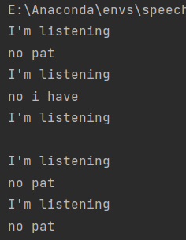

# Lab1 Automatic Speech Recognition

[TOC]

## Question1：The modifications to GUI and the codes

### Modify `arsInterface.py` file

#### 1. Add a clickable button

```python
# add button
self.button1 = QPushButton("第一个按钮", self.centralwidget)
self.button1.setGeometry(QtCore.QRect(57, 400, 200, 20))
self.button1.setText("Click Here to Start！")
self.button1.setStyleSheet("color: rgb(240, 40, 60);")
self.button1.setCheckable(True)
```

- The user clicks button to start speech recognition

#### 2. Add a microphone gif

```python
# add microphone gif
self.voiceFig_ = QtWidgets.QLabel(self.centralwidget)
self.voiceFig_.setGeometry(QtCore.QRect(127, 330, 60, 60))
self.voiceFig_.setText("")
self.gif_ = QMovie("icon/play.gif")
self.gif_.start()
self.gif_.stop()
self.voiceFig_.setMovie(self.gif_)
self.voiceFig_.setScaledContents(True)
self.voiceFig_.setObjectName("voiceFig_")
```

- Prompt the user for voice input status

### Modify `ars.py` file

#### 1. Add functions

```python
def play_music():
    win32api.ShellExecute(0, 'open', 'music.mp3', '', '', 1)


def open_notepad():
    win32api.ShellExecute(0, 'open', 'notepad.exe', '', '', 1)


def open_webpage():
    webbrowser.open("https://www.bing.com")


def recognize_speech_from_mic(recognizer, microphone):
    """Transcribe speech from recorded from `microphone`.

    Returns a dictionary with three keys:
    "success": a boolean indicating whether or not the API request was
               successful
    "error":   `None` if no error occured, otherwise a string containing
               an error message if the API could not be reached or
               speech was unrecognizable
    "transcription": `None` if speech could not be transcribed,
               otherwise a string containing the transcribed text
    """
    # check that recognizer and microphone arguments are appropriate type
    if not isinstance(recognizer, sr.Recognizer):
        raise TypeError("`recognizer` must be `Recognizer` instance")

    if not isinstance(microphone, sr.Microphone):
        raise TypeError("`microphone` must be `Microphone` instance")

    # adjust the recognizer sensitivity to ambient noise and record audio
    # from the microphone
    with microphone as source:
        recognizer.adjust_for_ambient_noise(source)
        audio = recognizer.listen(source)

    # set up the response object
    response = {
        "success": True,
        "error": None,
        "transcription": None
    }

    # try recognizing the speech in the recording
    # if a RequestError or UnknownValueError exception is caught,
    #     update the response object accordingly
    try:
        response["transcription"] = recognizer.recognize_sphinx(audio)
    except sr.RequestError:
        # API was unreachable or unresponsive
        response["success"] = False
        response["error"] = "API unavailable"
    except sr.UnknownValueError:
        # speech was unintelligible
        response["error"] = "Unable to recognize speech"

    return response
```

- Implementation functions that play music、open notepad、open webpage through python code
- Implementation speech recognition function refer to `guessTheWord.py`

#### 2. Create a speech recognition thread

```python
class MyThread(threading.Thread):
    def __init__(self):
        super(MyThread, self).__init__()
        self.recognizer = sr.Recognizer()
        self.microphone = sr.Microphone()

    def run(self):
        res = recognize_speech_from_mic(self.recognizer, self.microphone)
        if res["error"]:
            print("ERROR: {}".format(res["error"]))
        else:
            words = res["transcription"]
            print(words)
            if "play" in words or "music" in words:
                play_music()
            elif "open" in words or "notepad" in words:
                open_notepad()
            elif "web" in words or "page" in words:
                open_webpage()
		
        # operations after recognize
        application.recognize_over()
```

- In constructor, it initializes the`recognizer` and `microphone`
- In `run()` method, it calls `recognize_speech_from_mic` to transcribe audio input from the microphone.
- If an error occurs during recognition, the error message is printed. Otherwise, the transcribed words are printed, and if they contain certain keywords, three different functions `play_music`, `open_notepad`, and `open_webpage` are called.

#### 3. Bind button click event

```python
# Visual window
class myWindow(QtWidgets.QMainWindow):

    def __init__(self):
        super(myWindow, self).__init__()
        self.myCommand = " "
        self.ui = Ui_MainWindow()
        self.ui.setupUi(self)
        self.myThread = None

        # add button binding events
        self.ui.button1.clicked.connect(self.button_click)

    def button_click(self):
        # play microphone gif
        self.ui.gif_.start()
        # modify button content
        self.ui.button1.setText("Please say")
        try:
            # Start the voice recognition thread
            MyThread().start()
        except:
            print("thread start failed")

    def recognize_over(self):
        # play microphone gif
        self.ui.gif_.stop()
        # modify button content
        self.ui.button1.setText("Click Here to Start！")
```

- When the user clicks the button, the microphone gif is played first, indicating that the user can enter speech, and the text on the button is also changed then the `recognize()` function is called for speech recognition
- When the recognition process is over, the gif will stop playing and the text on the button will be reset.

## Question2：The accuracy of speech recognition and how to improve it, if possible?

### The accuracy of speech recognition

Through the experiment, the speech recognition accuracy of the `SpeechRecognition` library  is particularly low. The figure below shows the result of repeating the word "notepad".



There are several possible reasons why speech recognition accuracy may be low, including:

- **Speech quality**: Speech recognition requires a clear and stable sound signal. Poor speech quality, such as noisy environments or unclear speech, can lead to lower recognition accuracy.
- **Speaker accent and speaking rate**: Different speaker accents and speaking rates may cause different pronunciation and speech rhythm, which can make speech recognition difficult.
- **Library performance**: The performance and algorithms of the speech recognition library used can also affect accuracy. If the library used is not powerful enough or not suitable for a specific task, it may lead to lower recognition accuracy.

### Methods to improve accuracy

- **Improve speech quality**: Speech recognition in a quiet environment, and use a high volume
- **Change command set**: Use words that are easier to recognize as commands
- **Use more advanced speech recognition libraries**: Use more advanced speech recognition libraries, such as deep learning technology, to improve recognition accuracy.