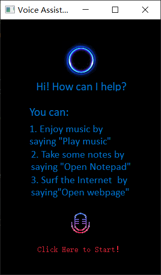
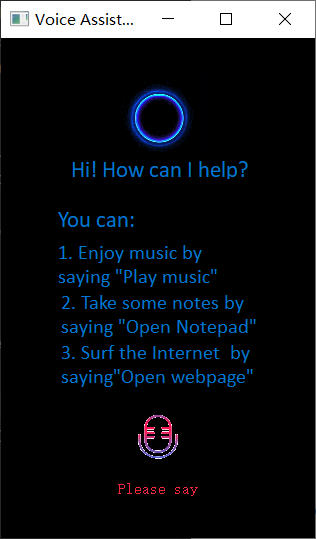

# HCI Lab1 - ASR

### 1. Install Dependencies

- Install `pocketsphinx`
  - [conda创建python虚拟环境，安装pocketsphinx | 码农家园 (codenong.com)](https://www.codenong.com/jsc960fad3783f/)
- Install `pyaudio`
  - [Anaconda 安装pyaudio方法_anaconda安装pyaudio_Ecs_tasy94的博客-CSDN博客](https://blog.csdn.net/Ecstasy94/article/details/109690343)

### 2. Run Project

#### In Pycharm IDE:

1. Open directory *lab1-asr* as a Pycharm project.
2. Right-click on *asr.py*.
3. Click *run*.

#### In Command line:

1. `cd lab1-asr`
2. `python asr.py`

### 3. Interactive Process

When you run the program, the following page is displayed：

Clicking on the red font prompts the user for voice input：

After completing the speech recognition process, you will return to the interface as shown in the first picture. You can click the button for voice recognition again.

### 4. Usage

1. You can enjoy music by saying "play music".
2. You can take some notes by saying "open notepad".
3. You can surf the Internet by saying "open web page".